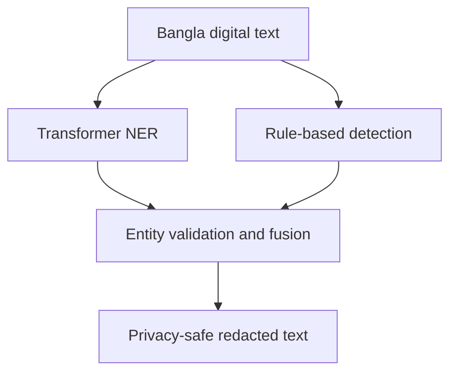

<div align="center">

<!-- Animated header -->


<a href="https://git.io/typing-svg">
  
</a>

<br>

<a href="https://github.com/SK-Rudra">
  
</a>
<a href="https://www.linkedin.com/in/shahriar-karim-rudra-20ab08315/">
  
</a>
<a href="mailto:s.k.rudra1502@gmail.com">
  
</a>

<br><br>


</div>

## `$ whoami`

I am a **Computer Science undergraduate at BRAC University** with a growing focus on **Natural Language Processing, Machine Learning, and privacy-aware AI**. I enjoy turning research ideas into practical systems—especially for languages and communities that are often underrepresented in mainstream technology.

My current research explores how machine learning can detect and safely redact **personally identifiable information from Bangla digital text**, combining transformer-based NER with rule-based detection.

```yaml
name: Shahriar Karim Rudra
location: Dhaka, Bangladesh
education: BSc in Computer Science — BRAC University
focus: [Natural Language Processing, Machine Learning, Bangla AI]
research: Privacy-preserving PII detection and redaction
currently_learning: [Data Structures & Algorithms, LLM Engineering, MLOps]
principle: "Build with purpose. Improve with evidence. Ship with care."
```

## `> research_spotlight`

<table>
  <tr>
    <td width="68%" valign="top">
      <h3>🔐 Bangla PII Detection & Redaction</h3>
      <p><strong>Thesis:</strong> Machine Learning-Based Detection and Redaction of Personally Identifiable Information in Bangla Digital Text for Privacy-Preserving Data Sharing.</p>
      <p>The planned system combines contextual entity recognition with deterministic rules to identify names, phone numbers, email addresses, national identifiers, locations, and other sensitive information before producing privacy-safe text.</p>
    </td>
    <td width="32%" align="center" valign="middle">
      <br><br>
      <br><br>
      
    </td>
  </tr>
</table>



## `> tech_stack`

<div align="center">

### Languages


### AI · ML · Data


&nbsp;&nbsp;

&nbsp;&nbsp;

&nbsp;&nbsp;


### Web · Database · Tools


</div>

## `> selected_work`

<table>
  <tr>
    <td width="50%" valign="top">
      <h3>🔐 Bangla Privacy NLP</h3>
      <p>A hybrid NLP pipeline for detecting and redacting sensitive information from Bangla text.</p>
      <p><code>Python</code> <code>BanglaBERT</code> <code>NER</code> <code>Regex</code> <code>FastAPI</code></p>
    </td>
    <td width="50%" valign="top">
      <h3>🛒 AURON</h3>
      <p>A database-driven supershop and online auction platform covering inventory, bidding, and transaction workflows.</p>
      <p><code>PHP</code> <code>MySQL</code> <code>JavaScript</code></p>
    </td>
  </tr>
  <tr>
    <td width="50%" valign="top">
      <h3>🚦 3D Traffic Simulator</h3>
      <p>An interactive simulation concept for exploring intelligent and adaptive traffic-flow management.</p>
      <p><code>Simulation</code> <code>AI</code> <code>3D</code></p>
    </td>
    <td width="50%" valign="top">
      <h3>📊 Applied ML Experiments</h3>
      <p>End-to-end experiments covering data preparation, feature engineering, model evaluation, and iteration.</p>
      <p><code>Pandas</code> <code>NumPy</code> <code>Scikit-learn</code></p>
    </td>
  </tr>
</table>

<div align="center">
  <a href="https://github.com/SK-Rudra?tab=repositories">
    
  </a>
</div>

## `> github_analytics`

<div align="center">


<br>


<br>


</div>

## `> current_mission`

<div align="center">


</div>

<br>

<div align="center">

### Let’s build something meaningful.

I’m always interested in thoughtful conversations about **NLP, Bangla language technology, machine learning, and research collaboration**.

<a href="mailto:s.k.rudra1502@gmail.com">
  
</a>

<br><br>

<sub><code>Learn.</code> · <code>Build.</code> · <code>Measure.</code> · <code>Improve.</code> · <code>Ship.</code></sub>


</div>
